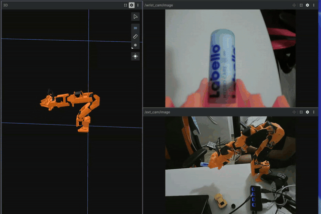
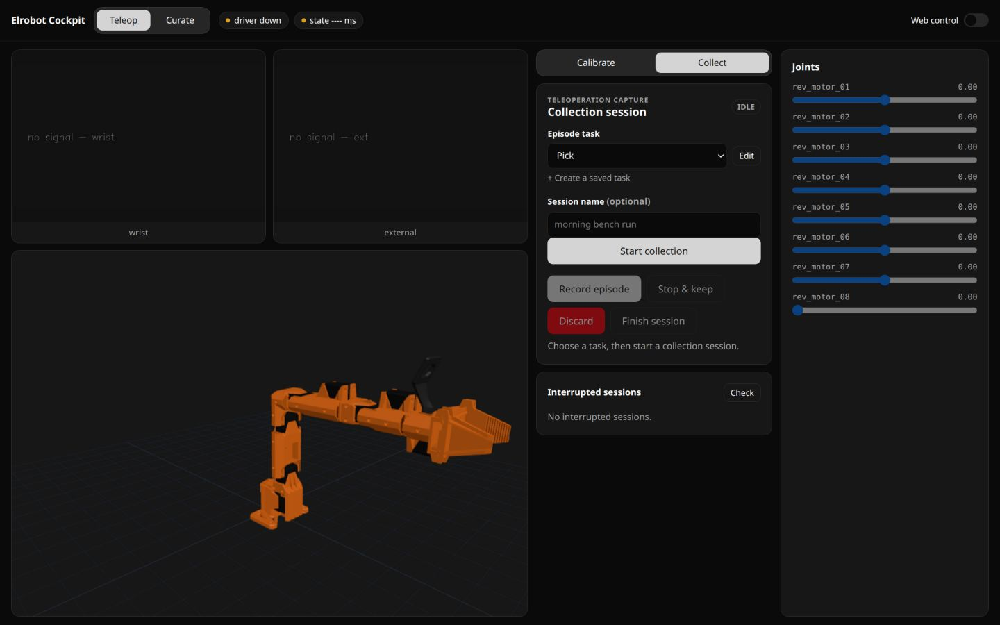
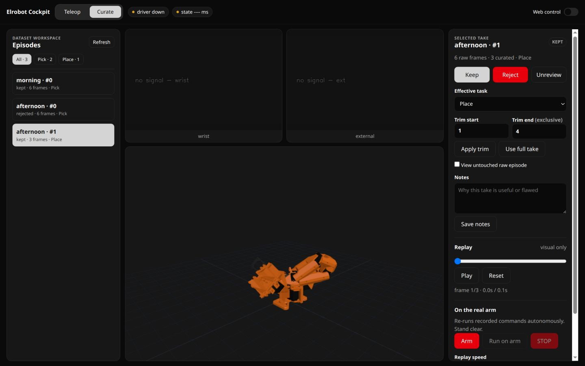
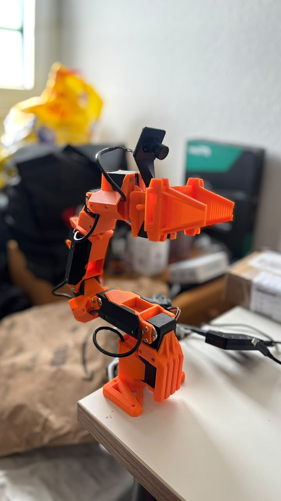
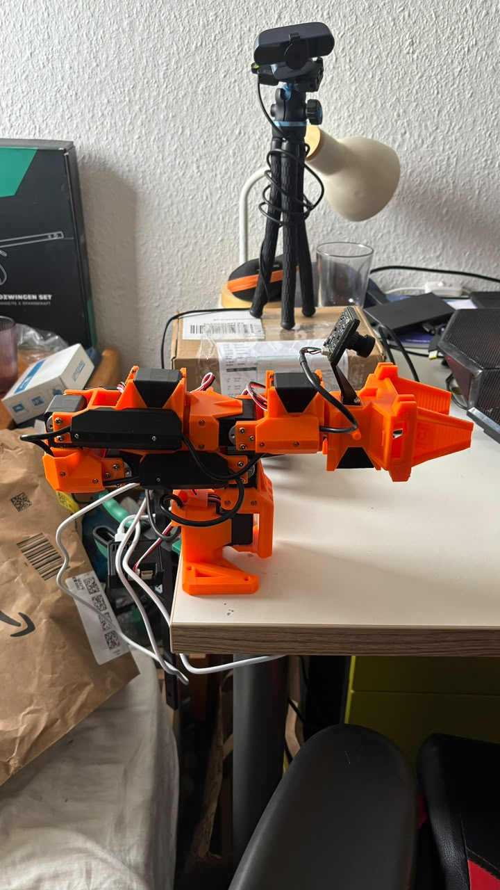

# Elrobot ARKit Teleop

Teleoperate a real 7-DoF + gripper Elrobot arm with an iPhone. ARKit pose
(via [ZIG SIM PRO](https://1-10.github.io/zigsim/)) drives the end-effector
through damped-least-squares servo IK; screen touches work the clutch and
gripper. Includes contact-sensing grasping, three DoF modes, dual-camera
recording straight into LeRobotDataset for imitation learning, mcap session
capture for Foxglove, and a browser cockpit that drives the arm, runs the
calibration wizard, manages task-labelled collection, curates and replays
episodes, and exports immutable LeRobot v3 datasets
([guide](docs/web-cockpit-guide.md)).



*Live session in Foxglove — the display model follows the real arm from
`/joint_states` while the wrist and external cameras stream alongside it.
[Full 47 s clip](assets/foxglove-demo.mp4).*

```
iPhone ──UDP──▶ arkit_receiver ──/target_pose──▶ ik ──/joint_command──▶ elrobot_driver ──serial──▶ arm
                                                  ▲                          │
                                                  └───────/joint_states──────┘
```

Three ROS 2 nodes over DDS. `elrobot_driver` is the **only** code that
touches hardware — every safety rule (velocity clamp, workspace box,
singularity floor, deadman freeze, grasp latch) lives there and is unit
tested against a stub bus.

## Cockpit



*Teleop → Collect with the camera stage, live URDF, managed session controls,
and joint rail. Hardware was intentionally disconnected for this capture.*



*Curate groups episodes by task and keeps review, task reassignment, trimming,
visual replay, guarded physical replay, and export in one workspace. The
episodes shown are synthetic documentation fixtures.*

See the
[animated collection, curation, and export walkthroughs](docs/web-cockpit-guide.md#6-collection-and-curation).

## Hardware

| | |
|---|---|
| Arm | Elrobot 7R + gripper, Feetech STS3215 servos, CH343 serial (`/dev/ttyACM*`) |
| Cameras | Innomaker U20CAM-1080P on the gripper + external webcam |
| Phone | iPhone running ZIG SIM PRO (ARKit + touch, UDP JSON, :50000) |

<p align="center">
  
  
</p>

The wrist camera rides on a printed bracket above the jaws (its mount and
optical frame are in the display URDF, so its view is a real TF); the external
webcam sits on a tripod for scene context. Both feed the recorder.

## Quickstart

```bash
# one-time: install pixi (pixi.sh), then
pixi install
pixi run prove-env          # all stacks import in one process
pixi run test               # every offline test suite (no hardware needed)

# a teleop session (arm plugged in, calibrated):
pixi run m3-arm             # phone drives the real arm (+ rviz)
pixi run web                # prints the browser cockpit URL
pixi run cams               # WRIST_DEV=/dev/videoX EXT_DEV=/dev/videoY
pixi run replay             # standalone Textual record/manage/replay/export TUI
pixi run bag                # optional: everything to mcap
```

Use **Teleop → Collect** in the cockpit for managed task-labelled recording.
`pixi run record` remains available for standalone CLI capture, but do not run
it alongside a managed cockpit collection session.

For the standalone workflow—no cockpit required—run the arm, cameras, and TUI
in separate terminals:

```bash
pixi run m3-arm
WRIST_DEV=/dev/video4 EXT_DEV=/dev/video6 pixi run cams
pixi run replay
```

Record needs the phone or another command source plus both fresh camera
streams. Physical replay pauses phone IK, requires typing `arm`, and refuses
to start while jog, cockpit, or another `/joint_command` publisher is present.
Management edits only an adjacent JSON overlay; raw LeRobot datasets remain
unchanged. Cleaned, versioned exports are written under
`data/episodes/exports/`.

First time on new hardware: calibrate first — the guided procedure is the
`/recalibrate` Claude skill, or follow the spec's Calibration section
(M1a → M1b → sign verification). **Never** run the driver uncalibrated.

## Tasks

| task | what |
|---|---|
| `m3-arm` / `m3-arm6` / `m3-arm5` | phone → real arm (7 / 6+1 / 5+1 DoF) |
| `jog` | slider GUI → real arm (sliders seed from the real pose) |
| `web` | browser cockpit on :8080 — teleop, managed collection, reversible curation, replay, calibration, LeRobot v3 export; prints its URL ([guide](docs/web-cockpit-guide.md)) |
| `view`, `m2` | visualization only, no hardware |
| `cams` / `campick` / `rqt-cam` | camera nodes / identify devices / view feeds |
| `record` / `replay` / `bag` | CLI recorder / standalone episode TUI / mcap rosbag |
| `bridge` | Foxglove WebSocket on :8765 (`rviz:=false` to drop rviz) |
| `ticks` | live joint monitor; releases torque (arm goes limp) |
| `test` / `lint` / `prove-env` | all offline suites / ruff / env import gate |

Tuning knobs as env prefixes: `PORT= SCALE= ORIENT=0 SMOOTH= MAX_VEL=
MAX_ACCEL= ACCEL= FREEZE= GRIP_LOAD_THRESH= GRIP_SQUEEZE= Z_MIN= R_MAX= RVIZ=0
COLLECTION_ROOT=`.

## Pipeline status

The collection and curation milestone is implemented and passes the complete
offline suite. Physical operator validation is still pending: collect a short
session, curate and visually replay it, run a guarded physical replay,
verify STOP/deadman behavior, then load the exported dataset.

Training and inference are the next phases and remain intentionally Python.
Rust/C++ ports are deferred unless measurements show a control deadline problem
that recorder thread tuning does not solve.

## Safety model

- The driver's module docstring is the safety contract; `pixi run python
  tests/test_driver_safety.py` proves all 10 mechanisms on a stub bus.
- `calibration/*.json` and `docs/urdf_Elrobot.urdf` are hand-measured
  physical truth — never edited casually (a repo hook blocks agent edits).
- Driver exit leaves torque ON holding; `pixi run ticks` releases
  it (the arm goes limp — support it).
- Integration tests pin `ROS_DOMAIN_ID=77` so they can never touch a live
  session.

## Repository map

```
src/elrobot/
├── nodes/        the three ROS 2 nodes (driver, ik, receiver) + cams + recorder
├── control/      cartesian_ik — DLS servo IK, task-priority frozen-joint modes
├── calibration/  guided procedures: bus probe, M1a/M1b, FK verification
├── web/          cockpit, collection catalog/manager, curation, replay, export
└── tools/        watch_ticks, cam_picker, nudge, viz-URDF generator
launch/           ros2 launch files (m3 / jog / cams / view / m2)
config/           view.rviz — edit this file to add displays, never rviz "Add Display"
tests/            offline suites, no hardware needed (pixi run test)
calibration/      servo tick ↔ URDF radian tables — sacred, hook-protected
docs/             real URDF (kinematic truth), vendored meshes, design spec
data/             collections, immutable exports, episodes, bags, derived viz meshes (gitignored)
tasks/            implementation plan + todo
AGENTS.md         conventions + hard rules, each earned by an incident
```

The full design rationale and decision history:
[`docs/superpowers/specs/2026-07-20-elrobot-arkit-teleop-design.md`](docs/superpowers/specs/2026-07-20-elrobot-arkit-teleop-design.md).

The implemented dataset workflow is specified in
[`docs/superpowers/specs/2026-07-28-collection-curation-design.md`](docs/superpowers/specs/2026-07-28-collection-curation-design.md).

## License

MIT. Arm meshes vendored from
[norma-core](https://github.com/norma-core/norma-core) (MIT), see
`docs/assets/LICENSE.norma-core`.
